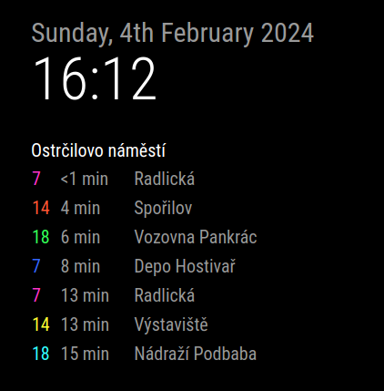

# MMM-PID
Magic Mirror Module for Prague Integrated Transport (PID)

- shows departures and time left from departure from selected stop or node and their end station
- departures time are calculated by position of the vehicle by PID, this is not time table but live data
- stop is single stop
- node is two or more spots that share same name and location

This module is using [Public Transport | Golemio API](https://api.golemio.cz/pid/docs/openapi/#/%F0%9F%9A%8F%20PID%20Departure%20Boards/get_pid_departureboards).



## Installation
```
cd ~/MagicMirror/modules/
git clone https://github.com/Zippycz3ch/MMM-PID
```

## Sample config
```
{
    module: "MMM-PID",
    position: "top_left",
    config: {
        accessToken: "accessToken",
        coloredSameRoute: false, // Set to true for colored same routes or false for regular colors
        updateInterval: 5000    // in ms
        feeds: [
            {
                aswIds: "522"
                title: "Ostrčilovo náměstí" // If no title is set, aswIds or ids is used
            },
            { 
                ids: "U522Z1P",
                limit: 2
            },
            {
                ids: "U522Z2P",
            }
        ],
    }
}, 
```
## Configurable option

| Option | Description | Default |
| :----- | :----- | :----- |
| `ids` | id of singular stop | `null` |
| `aswIds` | id of node | `null` |
| `Title` | Title of the feed | `ids` or `aswIds` of the stop/node|
| `limit` | How many entries should be loaded | 10 |
| `updateInterval` | How often should the module fetch new information | 5000ms |
| `coloredSameRoute` | Departures of the same number/line with same ending station, have their numbers color matched | `true` |
| `accessToken` | access token to golemio API | `null` |

## ApiKey and Stop IDs

[Register here for API key](https://api.golemio.cz/api-keys/auth/sign-in).

[Find your stop ids or node aswIds](https://raw.githubusercontent.com/Zippycz3ch/MMM-PID/main/stopids/stops.txt).

StopID U**754**Z1P = aswIds **754**