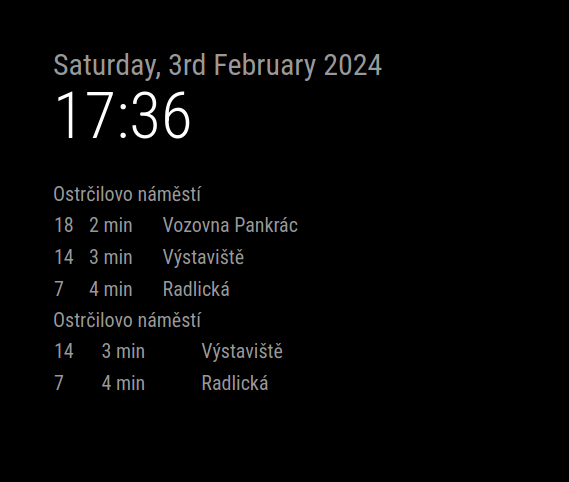
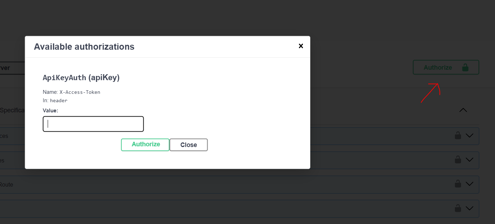

# MMM-PID
Magic Mirror Module for Prague Integrated Transport (PID)




- shows departures and time left from departure from selected stop or node and their end station
- stop is single stop
- node is two or more spots that share same name 

This module is using [Public Transport | Golemio API](https://api.golemio.cz/pid/docs/openapi/#/%F0%9F%9A%8F%20PID%20Departure%20Boards/get_pid_departureboards).

[Register here for API key](https://api.golemio.cz/api-keys/auth/sign-in).

[Get your stop or node ID] (https://api.golemio.cz/pid/docs/openapi/#/%F0%9F%A7%BE%20GTFS%20Static/get_gtfs_stops)




Sample config
```
{
    module: "MMM-PID",
    position: "top_left",
    config: {
        accessToken: "accessToken",
        feeds: [
            {
                aswIds: "522"

            },
            {
                ids: "U522Z1P",
                limit: 2
            },
            {
                ids: "U522Z2P",
                title: "Title"
            }
        ],
    }
}, 
```
