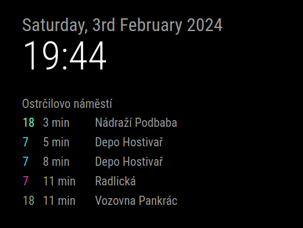

# MMM-PID
Magic Mirror Module for Prague Integrated Transport (PID)



Installation
```
cd ~/MagicMirror/modules/
git clone https://github.com/Zippycz3ch/MMM-PID
```

- shows departures and time left from departure from selected stop or node and their end station
- stop is single stop
- node is two or more spots that share same name 

This module is using [Public Transport | Golemio API](https://api.golemio.cz/pid/docs/openapi/#/%F0%9F%9A%8F%20PID%20Departure%20Boards/get_pid_departureboards).

Sample config
```
{
    module: "MMM-PID",
    position: "top_left",
    config: {
        accessToken: "accessToken",
        coloredSameRoute: false, // Set to true for colored same routes or false for regular colors
        updateInterval: 5000    // in ms
        feeds: [
            {
                aswIds: "522"
                title: "Ostrčilovo náměstí" // If no title is set, aswIds or ids is used
            },
            { 
                ids: "U522Z1P",
                limit: 2
            },
            {
                ids: "U522Z2P",
            }
        ],
    }
}, 
```

Configurable paramethers
aswIds
ids
Title
limit: 10
updateInterval: 5000
coloredSameRoute: true, // Default to true for colored same routes

[Register here for API key](https://api.golemio.cz/api-keys/auth/sign-in).


[Find your stop ids or node aswIds](stopids/stops.txt).

StopID U754Z1P = aswIds 754